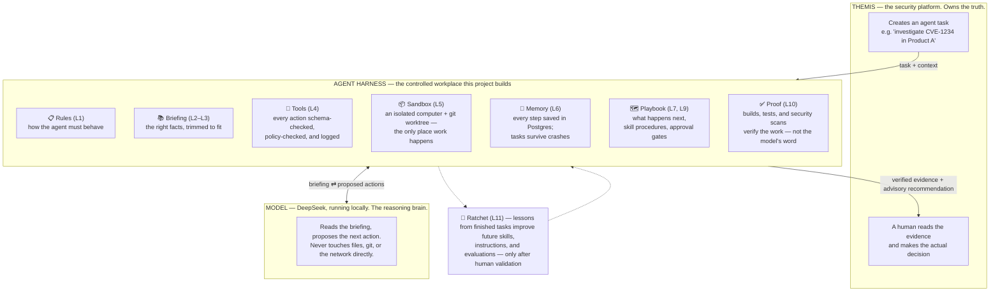
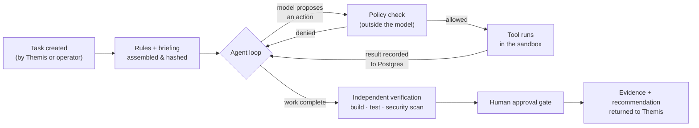

# Themis Agent Harness — Project Report

**Document type:** Project report — the reference document for the harness project
**Version:** 0.4 (v0.1 reviewed 2026-09-03; v0.2 adds the newcomer architecture diagrams in §3; v0.3 adds DEC-05/DEC-06 — model-agnostic implementation and role-neutral model framing; v0.4 widens OPEN-1 to the full runtime-skill design and distinguishes runtime skills from development-time Claude Code skills)
**Repository:** themis-ai-runtime
**Baseline:** [`architecture/harness-p0-architecture-v2.md`](architecture/harness-p0-architecture-v2.md) + the 2026-09-03 decisions
**Review copy:** published as the "Themis Harness Charter" artifact; change requests reference sections by number (§10)

---

## 1. What this project builds

The Themis Agent Harness is an AI execution and control plane that lets **Themis** — the vulnerability-management platform that owns security knowledge, Findings, Enterprise Positions, and governance — delegate real engineering and security tasks to an AI agent, safely and verifiably.

The harness supplies everything a model needs to actually perform work: behavioral instructions, task context, controlled tools, a sandboxed computer, durable task state, orchestration, repeatable skills, independent verification, and full observability. The model (DeepSeek-family) supplies reasoning. Themis keeps authority over truth.

> **P0 proposition — the single sentence this project is judged by:**
> Themis can delegate a real engineering/security task to an AI agent, and the agent performs the task inside a controlled computer environment and returns *independently verifiable* evidence.

**In scope for P0**

- Two working agent skills, end to end: `investigate-cve` (read-only analysis) and `remediate-dependency` (code change with build/test/scan verification and human approval).
- All 11 architecture layers present in minimal form (§4), on a single machine.
- An agentic evaluation suite and a regression gate for model/prompt changes.

**Explicitly out of scope for P0**

- Subagent roles (Planner/Engineer/Analyst/Reviewer), the full Ratchet build-out, a web UI, Redis queuing, semantic vector retrieval, remote execution providers (Daytona/E2B), Kubernetes.
- Any transfer of authority: the harness never writes enterprise truth; every output is advisory.

## 2. Decisions already made

Settled 2026-09-03; these supersede the architecture v2 document where they conflict. Each is open to a change request.

| ID | Decision | Why |
|---|---|---|
| DEC-01 | The harness is built in **Go**, not Python/FastAPI | Matches Themis (Go) and this repo; reuses the existing model layer and benchmark harness; Themis's own history records "all-Go won" for a prior Python proposal. Nothing in the 11 layers requires Python. |
| DEC-02 | It grows **inside this repository**, restructured as a monorepo: the Go module lives at `src/harness/`, and the Themis application is expected to join under `src/` later (root `go.work` in place) | Done — commit 570226c, history preserved as renames. |
| DEC-03 | Models are **local-first**: DeepSeek-family open weights served locally (Ollama) by default; the hosted DeepSeek API is allowed only per-task via an explicit, recorded policy/egress decision with brokered credentials | Honors Themis's no-silent-egress rule while keeping the strongest model reachable when a human approves it. |
| DEC-04 | P0 is delivered as a **thin vertical slice** through all layers, not a horizontal layer-by-layer build-out | Proves the P0 proposition earliest; every layer exists but only as deep as the current slice needs. |
| DEC-05 | **Implementation is model-agnostic.** DeepSeek is the planned P0 provider, but no code, prompt, schema, or test may assume DeepSeek specifically; provider-specific behavior lives only behind the model adapter and registry, and the test suite runs entirely on mocks | DeepSeek is a deployment choice, not an architectural dependency; the provider must be swappable by configuration alone. (2026-09-04) |
| DEC-06 | **The model is never told it is the security system.** Prompts frame the model's role neutrally; it reasons over context supplied by Themis/the harness without being granted authority framing | Came out of the architecture discussions: a model that believes it holds security authority is more likely to act like it does. Authority lives in Themis and in deterministic policy — the framing must match. (2026-09-04) |

**Standing constraints** (inherited from Themis decision records — not renegotiable here):

- Every AI output is an advisory, schema-validated proposal; `requires_human_decision` is always true; AI proposals never auto-accept.
- Instructions guide the model but never enforce security — enforcement lives in the tool gateway and policy layer, outside the model.
- Verification is independent: the model cannot self-certify success.
- Determinism and attributability: pinned generation options, recorded model + options + prompt hashes on every invocation.
- Repository content and tool output are untrusted data, never instructions.

## 3. Architecture at a glance (start here if you're new)

Three parties, one strict division of power: **Themis** knows and decides, the **Harness** works safely, the **Model** only thinks.



And the life of a single task, from creation to decision:



Key ideas to hold onto:

- **The model is never trusted with power.** It can only *propose* actions; the harness validates, permits, executes, and records each one. Even "the task succeeded" is decided by builds, tests, and scans — never by the model's own claim.
- **Everything is replayable.** Instructions, prompts, and options are hashed and stored; every tool call is audited. A finished task can be reconstructed step by step.
- **Humans stay in charge.** Code changes wait at an approval gate, and every recommendation returns to Themis marked *advisory* — the harness cannot create enterprise truth.

## 4. Architecture — the 11 layers and their P0 scope

Full detail lives in [`architecture/harness-p0-architecture-v2.md`](architecture/harness-p0-architecture-v2.md) and the per-layer documents (`architecture/layer-NN-*.md`). This table is the P0 contract per layer, tagged with the slice that first needs it (§6).

| # | Layer | Question it answers | P0 scope | First needed |
|---|---|---|---|---|
| L1 | Instructions | How must the agent behave? | Deterministic resolver over harness + Themis + task instruction sources; precedence; SHA-256 of the effective set. Conflict detection limited to protected-category checks (semantic detection deferred). Role framing is neutral per DEC-06 — the model is never told it is the security system. | Slice 1 |
| L2 | Context delivery | What information is available? | Themis API, git, filesystem, SBOM, scan results. No direct database access, ever. | Slice 1 |
| L3 | Context management | What is relevant? | Lexical retrieval (ripgrep), metadata filtering, token-budgeted prompt assembly. No vector DB in P0. | Slice 1 |
| L4 | Tool interface | What can the agent do? | Tool registry with JSON-schema args, per-skill allowlist policy, audit event per call. Read-only tools first; write/build/scan tools in Slice 2. *Open decision on `run_command` — §9.* | Slice 1 |
| L5 | Execution environment | Where can it work? | Docker sandbox; read-only repo mount (Slice 1), isolated git worktree (Slice 2). Execution-provider abstraction for later remote providers. Credentials brokered, never in model context. | Slice 1 |
| L6 | Durable state | What survives failure? | PostgreSQL: tasks, steps, tool calls, checkpoints, approvals. Task resumes after process kill. No Redis in P0. | Slice 1 |
| L7 | Orchestration | What happens next? | Agent loop (messages → model → tool dispatch → persist), termination budgets (steps/tokens/time), approval gate, HTTP task API. Deterministic lifecycle hooks kept minimal. | Slice 1 |
| L8 | Subagents | Which specialist does what? | Deferred — but the task model is built recursive so roles are additive later. | post-P0 |
| L9 | Skills & procedures | How is this kind of task done? | Two skills: `investigate-cve`, `remediate-dependency` — declared context, allowed tools, checkpoints, output schema. *Open decision on format — §9.* | Slice 1 |
| L10 | Verification & observability | Did it succeed, and what happened? | Grounding check on evidence; build/test/lint/security-scan results recorded independently (Slice 2); full per-step trace (model, options, tokens, latency, tool timeline, hashes); structured logs; OTel spans. | Slice 1 |
| L11 | Ratchet | How does experience improve the system? | Evaluation half only: an "Agentic" benchmark category in themis-bench + the existing regression `gate` as the model ratchet. Failed real tasks become new scenarios (manually). Knowledge/skill/instruction ratchets deferred. | Phase 5 |

**What already exists and is reused**

- `src/harness/internal/llm` — model runtimes (Ollama + OpenAI-compatible), registry, pinned deterministic options. Evolves to a chat + native-tool-call interface (Phase 1); becomes the Model Adapter.
- `src/harness/benchmarks` (themis-bench) — 20 deterministic security benchmarks with a regression gate. Becomes the Layer 11 evaluation foundation.
- Existing deterministic guardrails (prompt-injection flagging, output contracts) — extended, not replaced.

## 5. Requirements

### 5.1 Functional (P0 acceptance, condensed from the architecture's Definition of Done)

- Themis (or an operator) can create an agent task over HTTP; instructions are resolved, versioned, and hashed; context is retrieved and ranked.
- The model is invoked through the adapter and uses only registered, schema-validated, policy-allowed tools; every call is audited.
- The agent navigates a real repository, and (Slice 2) modifies code in an isolated worktree, builds, tests, and security-scans it.
- Task state survives process failure and resumes from checkpoint; human approval is required before any commit.
- Results return as schema-validated advisory evidence; a complete trace reconstructs every step; verification results come from tools, not model claims.
- Prompt-injection content in repositories is treated as data; a prohibited operation is denied by policy and recorded, and the agent continues safely.

### 5.2 Non-functional

| Property | Requirement |
|---|---|
| Security | No secrets in model context (credential broker); sandbox isolation for all agent-driven execution; no data egress without a recorded operator decision; policy enforcement outside the model. |
| Determinism | Pinned generation options; instruction-set and prompt hashing; identical task + tools ⇒ reproducible trace (modulo latency). |
| Auditability | Every model call, tool call, approval, and verification result persisted and exportable as JSON. |
| Resilience | Degrade-not-fail budgets (step/token/time ceilings); recovery from process kill (architecture Test 7). |
| Testability | Full suite runs without a live model (scripted-model mocks); CI on Linux from day one. |
| Simplicity | Single machine; stdlib-first Go; each new dependency individually justified. |

### 5.3 Hardware

| Stage | Machine | Requirement | Needed by |
|---|---|---|---|
| Development | Current Mac (Apple Silicon) | Coding + scripted-model tests need nothing special. Live local models: 32 GB unified minimum (14–16B q4), **48–64 GB recommended** (32B q4); ~50 GB disk for models; Ollama (Metal) + Docker Desktop. macOS containers get no GPU — the model runs on the host; only the agent workspace is containerized. | now |
| P0 target box | Ubuntu 24.04 workstation | GPU 24 GB+ VRAM (e.g. one RTX 4090; two for headroom) · 16–32 cores · 64–128 GB RAM · 1–2 TB NVMe + 2–4 TB data · 1 GbE. Rough cost €4–6k; a 128 GB Mac Studio is the simpler-but-slower alternative. | Phase 3–4 |

### 5.4 Software

| Dependency | Version | First used | Status |
|---|---|---|---|
| Go | 1.24+ | — | in place |
| Ollama | current | Phase 0 | in place |
| Docker Engine / Desktop | current | Phase 2 | **new** |
| PostgreSQL | 16+ | Phase 2 | **new** (Docker for dev) |
| ripgrep (sandbox image) | recent | Phase 2 | **new** |
| Grype (preferred) or osv-scanner | current | Phase 4 | **new**; Themis already speaks Grype formats |
| Go libraries: pgx, OTel SDK | — | Phases 2, 5 | **new**; no web framework — stdlib `net/http` |
| Redis, pgvector, web-UI stack | — | — | deliberately **not in P0** |

### 5.5 Model candidates (validated in Phase 0, not assumed)

| Model | VRAM (q4) | Role |
|---|---|---|
| `deepseek-coder-v2:16b-lite` | ~10 GB | Primary candidate (provider preference, strong coding) |
| DeepSeek-R1-Distill-Qwen 14B / 32B | ~9 / ~20 GB | Reasoning candidates — native tool-calling reliability unproven; must pass the spike |
| `qwen2.5-coder:32b` | ~20 GB | Control — best-in-class local tool calling; keeps the DeepSeek choice honest |
| DeepSeek hosted API | — | Increment 2 only; per-task policy-gated egress |

## 6. Delivery strategy — two vertical slices

Rather than building the 11 layers horizontally, the plan drives two end-to-end slices; the second reuses everything the first builds.

- **Slice 1 — `investigate-cve` (read-only).** Agent receives a Themis Finding, explores a repository in a sandbox, and returns a grounded applicability recommendation with a full trace. Smallest tool surface; proves loop, state, sandbox, instructions, trace, and the Themis return path.
- **Slice 2 — `remediate-dependency` (read-write).** Adds write tools, worktree isolation, build/test/scan verification, and the human approval gate — the complete P0 proposition.

## 7. Timeline, phases, and effort

Assumes one senior engineer with AI assistance, full-time, starting Monday 2026-09-07. Part-time stretches the calendar linearly; effort totals hold.

| Phase | Dates | Delivers | Gate to pass | Effort |
|---|---|---|---|---|
| **0** Model spike | Sep 07–11 | "Agentic" benchmark category (3–5 tool-call scenarios, deterministic scoring); candidate models measured; the two open ADRs decided (§9); architecture doc amended to v2.1. | ≥1 local model passes the agentic scenarios acceptably — else Increment 2 moves forward in the plan. | 1.0 wk |
| **1** Model layer | Sep 14–23 | `ChatRuntime` interface (messages + native tool calls) for Ollama `/api/chat` and OpenAI-compatible endpoints; registry + scripted-mock tests. Existing benchmark runtime untouched. | Scripted multi-turn tool-call conversation passes against both runtime mocks. | 1.5 wk |
| **2** Slice-1 core | Sep 24 – Oct 16 | Postgres task state + migrations; HTTP task API; agent loop with budgets; instruction resolver (M1 scope); tool gateway (schema + policy + audit); read-only toolset; Docker sandbox with read-only repo mount. | End-to-end run on a toy repo with scripted model; task survives process kill and resumes (Test 7). | 3.5 wk |
| **3** Slice 1 | Oct 19–30 | `investigate-cve` skill; context assembly (lexical ranking, token budget); grounded advisory result; full trace export; evidence return to a Themis inbox endpoint. | Live demo: real Finding → sandboxed investigation by a local model → grounded recommendation + complete trace. | 2.0 wk |
| **4** Slice 2 | Nov 02–17 | Write tools + worktree isolation; build/test/lint/security-scan verification recorded independently; approval gate; `remediate-dependency` skill with checkpoints; injection defenses (Test 8). | **The P0 proposition:** one real dependency remediation, sandboxed, independently verified, human-approved. | 2.5 wk |
| **5** Eval | Nov 18–27 | Agentic suite grown to 8–10 scenarios covering the architecture's Tests 1–8; `themis-bench gate` wired as the model ratchet; failure-to-regression flow; OTel + structured logs polish. | A deliberate model swap is caught (or cleared) by the gate. | 1.5 wk |
| **Inc. 2** Hosted egress | parallel, after Phase 3 | Credential broker; per-task egress policy with recorded operator decision; DeepSeek API in the registry; agentic suite scored against it. | A hosted-model task runs only with the explicit flag; the decision is in the audit log. | 2.0 wk |

**Total: ≈12 engineer-weeks to the P0 Definition of Done** (≈10.5 to the headline demo); +2 weeks for Increment 2. Post-P0 build-out (subagents, more skills, full Ratchet, UI) is roughly another 8–12 weeks and gets re-planned on Phase 5's evaluation data.

*Confidence:* Phases 0–1 high; Phase 2 medium (sandbox lifecycle hides the unknowns); Phases 3–4 medium-low — they depend on how much skill/prompt iteration the chosen model needs, which is exactly what Phase 0 de-risks.

**Dependency graph**

```
Phase 0 ── go/no-go on local-only ── blocks everything
Phase 1 ── blocks the Phase-2 loop
Phase 2 ── state ┬ loop, sandbox ┬ tools (internal ordering)
Phase 3 ── needs the Themis inbox endpoint  ◀ only cross-repo dependency
Phase 4 ── needs the scanner choice (Grype preferred)
Phase 5 ── needs Slices 1–2 as scenario templates
Inc. 2  ── needs Phase 1 + tool gateway only; independent of 4–5
```

The Themis inbox contract should be agreed during Phase 2 (Themis already has the outbound-write seam from its Δ4b work) so it never blocks Phase 3.

## 8. Success metrics and risks

### 8.1 What gets measured (from Phase 5 onward)

- **Agent:** task completion rate, first-attempt success, tool-call failure rate, correct tool selection.
- **Verification:** build/test/scan pass rates, false-completion rate (model claims success, verification disagrees).
- **Efficiency:** task duration, tokens, model and tool calls per task.
- **Safety:** policy denials, injection-resistance results, secret-exposure incidents (target: zero).
- **Ratchet:** regression scenarios added and passing; model-version comparisons through the gate.

### 8.2 Top risks

| Risk | Mitigation |
|---|---|
| Local models can't do reliable native tool calling — *the* project risk | Phase-0 empirical spike with deterministic scoring and a non-DeepSeek control model; a failing gate moves the hosted increment forward instead of open-ended prompt tuning. |
| Sandbox lifecycle complexity (cleanup, caps, macOS/Linux drift) | Read-only mount first; writes only in Slice 2; Linux CI from day one. |
| Scope creep toward the full 11-layer vision | The slice gates are the scope contract; anything the current slice doesn't need goes to the deferred list. |
| Model-iteration burn (endless prompt tweaking) | Every prompt/skill change must move the agentic benchmark score — no untracked tuning. |
| Cross-repo drift on the evidence contract | Inbox schema agreed with the Themis repo during Phase 2. |

## 9. Open decisions — owner input requested

| ID | Decision | Notes |
|---|---|---|
| OPEN-1 | **Runtime skill design (L9) — dedicated discussion required.** Not just the format question (Markdown procedures the model reads vs. executable state machines the orchestrator steps through) but the full design: the skill catalog, structure (inputs, required context, allowed tools, procedure, checkpoints, verification, approval requirements), and how skills are authored, reviewed, and versioned. Note: these runtime skills are distinct from the *development-time* Claude Code skills in `.claude/` that govern how the harness is built. | Blocks Phase 3. Format recommendation stands: state-machine skeleton whose step bodies are Markdown instructions — checkpoints stay deterministic, procedure text stays cheap to edit. |
| OPEN-2 | **`run_command` policy (L4).** Strict command allowlist, or allow-inside-sandbox with the Docker boundary carrying the risk? | Blocks Phase 4. Recommendation: sandbox-and-allow with a deny-list for egress-capable commands; revisit on evaluation data. |
| OPEN-3 | **P0 hardware purchase.** Ubuntu 4090 workstation (~€4–6k), Mac Studio 128 GB, or defer until Phase 3 forces the call? | No blocker before Phase 3. |
| OPEN-4 | **Start date and staffing.** §7 assumes full-time from 2026-09-07. | Confirm or restate; the calendar re-derives from effort. |

## 10. How to request changes

Every section — including the decisions in §2 — is open to challenge. Reference sections by number (e.g. *"replace §6 with a three-slice plan"*, *"§5.3: no hardware purchase, plan around the Mac only"*). Wholesale rewrites are as welcome as line edits; each accepted change bumps the version with a change-log entry at the top of this file.

---

*Sources: `architecture/harness-p0-architecture-v2.md`, `architecture/layer-01-instructions.md`, `harness-p0-project-plan.md`, Themis EDR constraints.*
